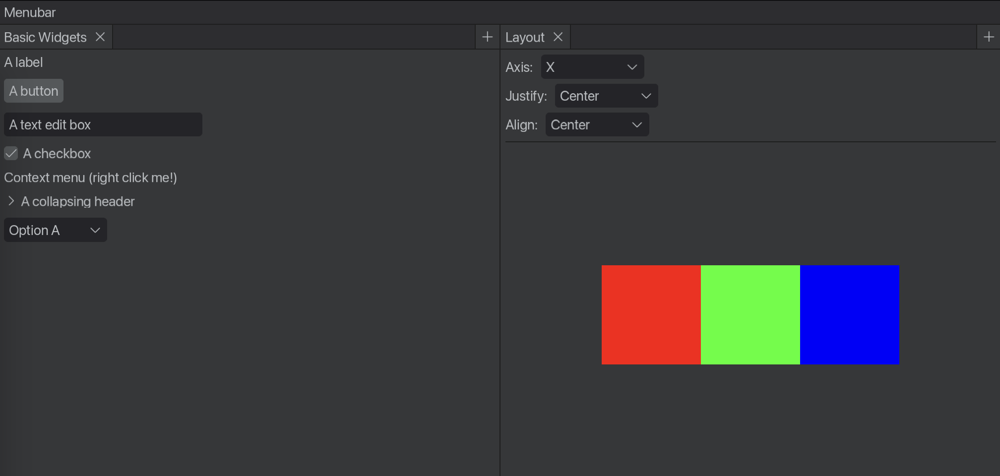

# Pierro

### Note: Pierro is currently work-in-progress. Expect breaking changes. Use at your own risk.

Pierro is a simple immediate mode GUI library for Rust.



* [Quick Start](#quick-start)
* [What is Immediate Mode UI?](#what-is-immediate-mode-ui)
* [Goals](#goals)
* [Non-Goals](#non-goaals)
* [Acknowledgements](#acknowledgements)
* [Namesake](#namesake)

## Quick Start

There are several examples of Pierro apps in the `examples/` folder of this repository. In particular, `examples/widget_gallery.rs` is a useful reference that shows how to use every widget in Pierro.

## What is Immediate Mode UI?

*Immediate Mode UI* is a style of UI library API where the entire UI is recreated every time the UI is painted and widgets are created by simply calling a function, like `pierro::button(...)`. This is opposed to *Retained Mode UI*, where a UI tree(retained between repaints) is incrementally modified and events are handled with callbacks. In retained mode UI, the life cycle of all widgets have to be carefully individually managed by either the programmer or some tree-diffing strategy like in React's Virtual DOM. With Pierro, you can write something like:
```rust
let mut show_label = false; // State stored somewhere else 

// UI code:
let button_label = if show_label { "Hide" } else { "Show" };
if pierro::button(ui, button_label).mouse_clicked() {
    show_label = !show_label;
}
if show_label {
    pierro::label(ui, "The label!");
}
```
...which you'd have to write like this with a retained-mode library:
```rust

let mut show_label = false;
let button = ui.add_button("Show");
let label = ui.add_label("The label!");

button.on_click(|| {
    show_label = !show_label;
    if show_label {
        button.set_text("Hide");
        label.show();
    } else {
        button.set_text("Show");
        label.hide();
    }
});
```

The main advantage of immediate mode UI is its ease of use: the API is simpler, less verbose, and the UI will react gracefully to changes in state without the programmer manually managing widget lifetimes in a stateful hiearchy.

This is, however, not without tradeoffs: most immediate mode UI libraries suffer from poor layout, high CPU usage, and other compromises. Thanks to its architecture, however, Pierro manages to avoid most of these drawbacks while retaining the ease-of-use of traditional immediate mode UI libraries.

## Goals

- **Simplicity.** Pierro's core consits of relatively few orthogonal concepts that are powerful enough to express everything you need for making great UIs. Idiosyncrasies, footguns and unintuitive behaviour are to be avoided at all costs. Everything should work reasonably and predictably, with minimum surprise.

- **Hackability.** Pierro doesn't try to hide anything from you or limit what you can do. All the widgets built in to the library are implemented with the same APIs you have access to. In fact, the core of Pierro doesn't implement *any* widgets at all - you could rewrite every widget yourself if you wanted, from buttons to scroll areas without touching the library itself. This way, if you need a widget we don't (yet) have or don't like how an existing widget works, you don't have to dig through the library or wait for a new release to fix it.

- **Focus on "Editor" Apps.** Pierro is geared towards making editor-type apps, like art software, image editors, DAWs, level editors, etc. Of particular intrest to me is making 2D animation software, which is what I'll be using to test Pierro and help drive its evolution. Though Pierro can be used for other kinds of apps, features relevant to making editor apps will be prioritized.

- **Great Layout.** Traditionally, immediate-mode UI libraries have suffered from being unable to do proper layout, since they had to render widgets with incomplete knowledge of the full UI tree. This leads to various unfortunate compromises, from forcing the user to do manual layout calculations to introducing a one-frame jitter to the UI while the library figures out how to do layout. However, thanks to [a new immediate mode UI architecture pioneered by Ryan Fleury](https://www.rfleury.com/p/ui-part-2-build-it-every-frame-immediate), we can now have a robust layout system while retaining the ease-of-use of an immediate mode API. Pierro implements a layout system inspired by CSS Flexbox.

- **Every Reasonable Battery Included.** Pierro aims to have everything most apps will eventually need built right in to the main library. We have a [built-in icon set](https://phosphoricons.com/), docking panels, IME input, bi-directional text input support, etc etc etc. Unless you're doing something very unusual, you shouldn't be forced to reach for third-party libraries. Everything you'll ever need will (eventually) be part of the main library.

Of course, these lofty ambitions are not yet fully realized at this early stage in development(in particular, I am still yet to make all those batteries Pierro needs to include). 

## Non-Goals

- **Backend Agnosticism.** Unlike most UI libraries in the Rust world, Pierro does not aim to be backend agnostic. Though I may create a backend layer in the future, Pierro is currently heavily coupled to WGPU for rendering and Winit for windowing and input. If you want to integrate a UI library into your game engine, Pierro is not for you.

- **Mobile.** Pierro does not support making mobile apps. 

## Acknowledgements 

I want to thank:

* [Ryan Fleury](https://www.rfleury.com/), whose amazing [UI series](https://www.rfleury.com/p/ui-part-1-the-interaction-medium) laid the foundations for Pierro's architecture. Even if you don't care about UI, this series is well worth reading for its unique approach to software architecture which I've found very useful.
* [Emil Ernerfeldt](https://github.com/emilk), creator of the excellent [Egui UI library](https://github.com/emilk/egui), from which I stole many brilliant ideas.
* [Raph Levien](https://raphlinus.github.io/), for his excellent blog articles on writing great UI libraries.
* [Helena Zhang](https://www.helenazhang.com/) and [Tobias Fried](https://tobiasfried.com/) for their incredible work on [Phosphor Icons](https://phosphoricons.com/), the icon set built in to Pierro. The icons are beautiful and a joy to work with.

## Namesake

Pierro is named after a character from a Soviet film called [The Adventures of Buratino](https://www.youtube.com/watch?v=vJFXsLXnvoU). Pierro is a puppet enslaved by Karabas Barabas to act in his theatre, until he eventually escapes to help Buratino find the golden key before Karabas and free the rest of the puppets. Pierro is in love with another puppet named Malvina, for whom he wrote [this serenade](https://www.youtube.com/watch?v=OXgjI5Tl_ik&ab_channel=SawromatArt). Though *The Adventures of Buratino* is based on a novel by Alexey Tolstoy published in 1936, Pierro's character has its origins in a much older [French character of the same name](https://en.wikipedia.org/wiki/Pierrot).
